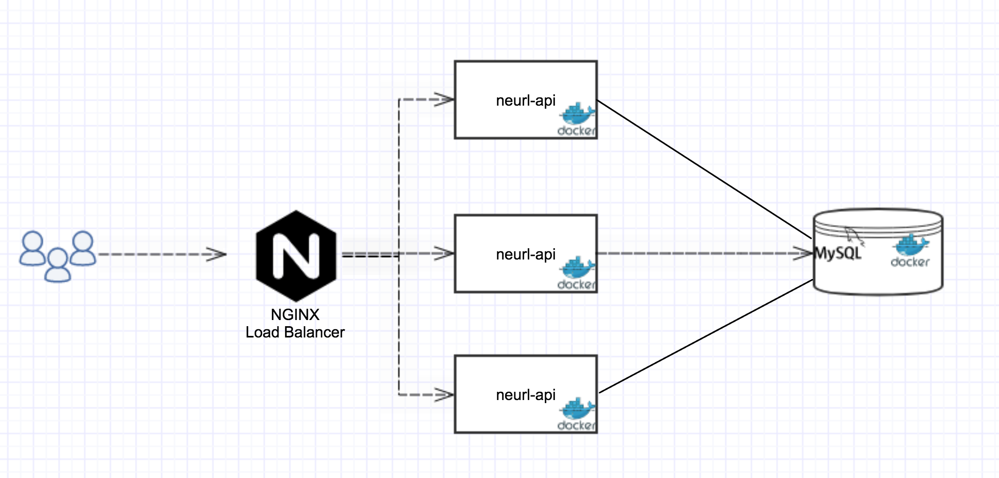

## NEURL API Shortening service

NEURL is a scalable URL Shortening service. It provides easy to use RESTFul APIs to create short URL which are 6 character long Base62 string.

It can support upto 62^6 = 58 Billion different URLs.

It can be scaled up to multiple instances running on docker container
The Docker compose also spins up the nginx proxy to load balance the instances
using round robin scheduling.



## How Build

* for maven build run

```
$ mvn clean install
```

* For code coverage

```
after build open this file in the browser
/target/site/jacoco/index.html

```


## How to Run using docker and scale up with 3 API instances

```
$ git clone https://github.com/niharikavashishtha/neurl-api.git
$ cd neurl-api
$ docker-compose up --build --scale neurl-api=3

```

## With In memory DB H2
```
$ mvn clean install
$ cd target/

$ java -jar -Dspring.profiles.active=h2 neurl-api-0.0.1-SNAPSHOT.jar

```

## How to test
I have added [PostMan collection](./POSTMAN.json) to test the APIs

## Things I learned and used in this project

#### Docker and docker compose
Tools to spin up multiple containers and scaling them.
#### Spring web REST
SpringBoot tools for building RESTful services.
#### Lombok
Convenient tool for code auto-generation.
#### Spring JPA, mysql, h2
SpringBoot tool for JPA for accessing databse.
#### Nginx proxy for load balancing
Proxy server for load balancing http requests.

## Things to be done

### User API key for authorization 
to shorten the URL the POST API call takes JSON in the body request. It can be subject to malicious 
attack i.e. user can flood our system with junk URLs. so we can add API key ID field in the 
LongUrlDTO to only allow register user to allow adding the URL.

### Performance testing
I have'nt done the performance testing yet, but I would like to know, how the
caching would improve the performance. I would use Apache Jmeter for this.

### Cleaning up old URLs
Old URL entries in the DB are not cleaned up, over the time it will increase DB size
We can use spring scheduler (@EnableScheduling) to run a job every day at mid night to check all entries
which are older than say 5 years and clean them up.

### Caching
We have used default spring cache which is in-memory ( ConcurrentHashMap)
But to optimize the performance we can use distributed cache like Redis.

### Swagger API Documentation
APIs are not documented yet, I would use swagger API documentation tool which provides 
@ApiOperation for this.

